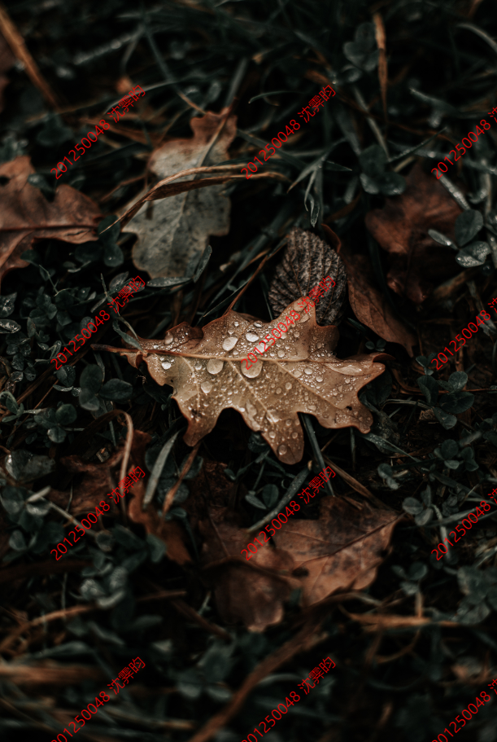

# README

## 动态水印-基于SVG的实现

具体实现见`/js/waterMark.js`

传统的动态水印都是先用 canvas 渲染上对应的文案，生成透明 png。存在一下几个问题：

1. 每次都要用 canvas （相对来说耗费的资源较多）
2. 很容易被人删除对应的节点/对应的背景图样式（不太安全）

使用 svg 的思路很简单，就是利用 `background-image: url('svgpath.svg')` 也能正常显示的特性（毕竟 svg 其实就是特殊一点的图片）。注意用`pointer-events: none`让水印的这一层不要拦截任何事件，全部穿透给下一层

```css
.watermark {
  --watermark: url("data:image/svg+xml,%3Csvg xmlns='http://www.w3.org/2000/svg' width='144px' height='144px'%3E  %3Ctext x='18' y='0' fill-opacity='0.1' fill='%23000' transform='translate(0,144)rotate(-45)' font-size='18'%3E沈霁昀%3C/text%3E%3C/svg%3E");
  background-image: var(--watermark);
    pointer-events: none;  
  /* 其余样式省略... */
}
```

css 变量定义成功后，那么用 js 控制 css 变量也是轻而易举了

在加上一些简单的控制，比如：

- svg 的宽度就约等于 文字的长度 * 字体大小
- 整个水印做下来是一个正方形，所以高度 = 宽度
- 用到 `.setProperty('--watermarksvg', watermarksvg)` 为 css 变量赋值

```javascript
let svgText = '沈霁昀'
let fontSize = 18
let svgWidth = fontSize * svgText.length
let svgHeight = svgWidth
let rotate = -45
watermarksvg = `url("data:image/svg+xml,%3Csvg xmlns='http://www.w3.org/2000/svg' width='${svgWidth}px' height='${svgHeight}px'%3E  %3Ctext  x='${fontSize}' y='0'  fill-opacity='0.1' fill='%23000' transform='translate(0,${svgHeight})rotate(${rotate})'    font-size='${fontSize}'%3E${svgText}%3C/text%3E%3C/svg%3E")`
document.querySelector('.watermark').style.setProperty('--watermarksvg', watermarksvg)
```

至此，动态的 svg 就实现了，svg 动态后，那作为背景的 svg 水印也就动态变化了。

最后`1.html`的效果如图：

## 频域水印

对彩色图像加水印，首先对图像的RGB颜色通道分别分离，对R，G，B三个通道的颜色分别计算频域，就和前几个章节处理的那样。

叠加混合的方式分为两种，称之为缩放叠加，一种为放大一种为缩小，因为二维傅里叶变换后的结果是一个复信号，因此，如果我们仅仅修改频谱能量而不影响其相位的话，应该将复信号的实部与虚部同比例放大或缩小就可以了。因此，水印也就是安装水印轮廓对对应复信号进行放大或缩小

峰值信噪比（PSNR），归一化相关系数（NC值）可用于判定水印对原图的影响及水印的抗干扰能力，两者都是越高越好，当然，这常常是一个相互矛盾的度量，往往抗干扰能力强也意味着对原图的干扰大。

使用`CryptoStego`库，对于写入水印，只需要调用`writeMsgToCanvas`方法即可，`writeMsgToCanvas('canvas', "201250048 沈霁昀", "", 0);`即将我的信息写入图片，密码设为空。

我们对接口进行了一定的修改，使得可以直接传入图片文件路径，在网页上显示加了水印的图片，打开`2.html`即可看到。

水印信息的验证也很简单，只需要保存图片，在选择文件时选择该图片，点击`Read message from image`，会出现弹窗，出现水印的文字内容。


