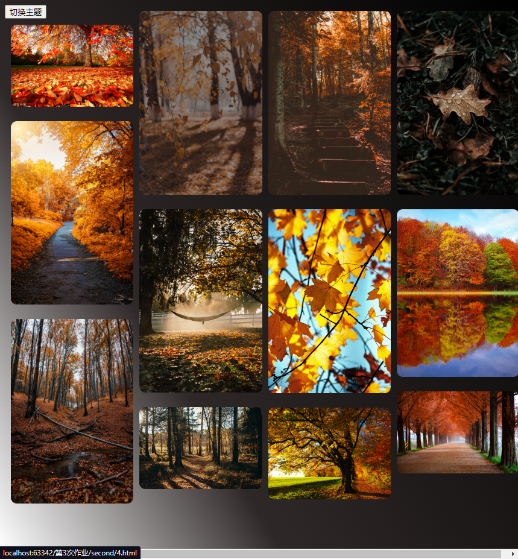

# README

这里我使用link标签动态引入的方案实现主题的切换。

其做法就是提前准备好几套`CSS`主题样式文件，在需要的时候，创建`link`标签动态加载到`head`标签中，或者是动态改变`link`标签的`href`属性。

首先，我在CSS目录下写了两套一级界面的CSS文件。略去相同的排列布局定义，背景颜色分别定义如下：

```css
/*bright.css*/
background-image: linear-gradient(59deg, #4158D0 0%, #C850C0 49%, #FFCC70 100%);
/*dark.css*/
background-image: linear-gradient(59deg, #ffffff 0%, #2f2828 33%, #000000 100%);
```

下面我们在first.html中添加一个按钮，并绑定onclick事件来实现主题的切换，点击按钮后，调用`theme()`函数，修改`href`属性指向的CSS文件，实现切换主题。

```html
<link rel="stylesheet" type="text/css" href="CSS/bright.css"><button type="button" onclick="theme()">切换主题</button>
<script type="text/javascript">
    function theme() {
        var link = document.head.getElementsByTagName("link")[0]
        if (link.getAttribute("href") === "CSS/bright.css") {
            link.setAttribute("href", "CSS/dark.css")
        } else link.setAttribute("href", "CSS/bright.css")
    }
</script>
```

效果如下图：



