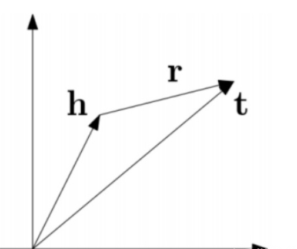

# 1.Abstract and Introduction

先前的知识图谱嵌入方法通常将实体映射到表示，并利用积分函数预测目标实体，但它们很难推理出罕见或新兴的未知实体。本文提出了一种新的知识图谱嵌入方法kNN-KGE，通过用KNN分类算法对其实体分布进行线性插值。我们根据实体嵌入空间与知识库的距离计算最近邻。我们的方法允许在模型参数中显式而非隐式地记忆罕见或新兴实体。实验结果表明，我们的方法可以改善归纳和转导链接预测结果，并在只有少量几个三元组的低资源设置下产生更好的性能，这可能更容易通过显式内存进行推理。

知识图谱（KG）以结构化的方式将事实组织为三元组，形式为<主语、谓语、宾语>，缩写为（s，p，o），其中s和o表示实体，p建立实体之间的关系。由于新兴实体及其在现实应用中的关系，大多数KG远没有完善；因此，拓展有缺失三元组的KG的问题吸引了研究人员。

之前大多数KG补全方法，如TransE【Bordes等人，2013年】、CompleEx【Trouillon等人，2016年】和RotatE 【Sun et al., 2019】，是一种知识嵌入技术，它将实体和关系嵌入到向量空间中，然后通过对这些向量使用预定义的评分函数来获得预测的三元组。这些方法通过端到端训练将所有关系知识隐式编码到参数神经网络的权重中。然而，这些方法的一个主要局限性是，它们很难通过少数三元组中的罕见实体或训练期间看不到的新兴实体进行推理。

注意到，复杂的系统相互作用促进了人类的推理，例如，整合当前知识和从记忆中检索。近年来，随着记忆增强神经网络的发展，将计算处理和记忆存储分离开来的模块化结构的设计应运而生。这些基于记忆的方法（或非/半参数方法）已成功应用于语言建模[Khandelwal等人，2020年]和问答[Kassner和Schütze，2020年】等任务，这些方法具有表达力和适应性。

受此启发，我们提出了kNN-KGE，这是一种通过使用k-最近邻（kNN）模型对其实体分布进行线性插值来扩展知识图嵌入的方法。如图1所示，我们构建了实体的知识库，并根据实体嵌入空间中的距离检索最近的邻居。给定一个缺少头或尾实体的三元组，我们使用[MASK]输出的表示作为预测锚实体嵌入，以查找知识库中的最近邻居，并用屏蔽实体预测插值最近邻居分布。因此，罕见的实体或新出现的三元组可以显式地记忆，这使得推理通过记忆而不是隐式地在模型参数中进行。在FB15k-237和WN18RR上进行的转导推理和归纳推理的实验结果证明了该方法的有效性。定性地，我们观察到我们的方法对于低资源知识图嵌入特别有用，通过显式内存可能更容易访问。

我们的贡献总结如下：

+ 据我们所知，这是第一种半参数的知识图嵌入方法。我们的工作为通过显式记忆改进知识图推理开辟了新途径。

+ 我们引入了可以明确记忆稀有或新兴实体的kNN KGE，这在实践中至关重要，因为KG在不断发展进化。

+ 在两个基准数据集上的实验结果表明，与基线相比，我们的模型可以产生更好的性能，特别有利于低资源推理。

# 2.问题描述

大多数知识图谱补全方法（如TransE、ComplEx和RotatE）都是将实体和关系嵌入到向量空间，然后通过对这些向量利用预定义的评分函数获取预测三元组的知识嵌入技术。这些方法通过端到端训练，将所有相关知识隐式编码到参数神经网络的权值中。然而，这些方法的一个主要限制是，它们几乎不能通过几个罕见实体或在训练中未见过的新实体进行推理。而且，对于罕见或新兴的实体，我们希望能够将他们加入到我们的知识图谱中，实现知识图谱的扩展，即我们希望能够存储这些实体。

记忆增强神经网络的最新进展导致了分离计算处理和记忆存储的模块化架构的设计。那些基于记忆的方法(或非/半参数方法)已经成功地应用于任务，如语言模型和问答，它们具有表达能力和适应性。受此启发，本文提出了kNN-KGE，这是一种通过用k近邻(kNN)模型线性插值其实体分布扩展知识图嵌入的方法。

# 3.输入、输出、模型算法描述

## 1. KNN-KG模型图

### 

kNN-KGE不仅利用softmax（MEM头）的实体预测，而且还从实体描述和训练三元组构建的知识库中检索实体。

实体词汇扩展（图a），屏蔽实体建模（图b），以及从描述和三元组中构建知识库（图c）。彩色的实体将被编码为上下文的实体表示，并添加到的知识库中。

## 2. 通过Masked实体模型进行实体词汇的扩充

由于利用子词进行实体推理是不容易的，本文直接利用每个唯一实体的嵌入，就像常见的知识嵌入方法一样。具体来说，将实体表示为语言模型词汇表中的特殊符号；因此，知识图谱推理可以重构为屏蔽实体预测任务，获取实体的嵌入表示。

## 3. 知识存储推理

通过上下文KG表示可以推断出缺失的三元组，和罕见的或新兴的实体。受记忆增强神经网络最近进展的启发，本文构建知识存储来显式记忆实体。主要从两个部分构建知识存储：代表语义信息的实体描述和代表结构知识的实体三元组。使用上下文KG表示训练的模型从两个方面构建知识存储，罕见的或新兴的实体可以显式地表现在外部存储器中，具有灵活性和适应性。 

## 4. 记忆推理

对于知识图谱补全任务，给定一个头尾实体缺失的三元组，我们使用[MASK]输出的表示作为预测锚实体嵌入，在知识存储中找到最近的邻居。

# 4. 评价指标及计算公式

本实验使用的评价指标为 `mean reciprocal rank(MRR)`、`Mean Rank(MR)`以及`Hits@{1,3,10}`，具体计算公式与解释如下：

## 1. MRR

MRR的全称是Mean Reciprocal Ranking，其中Reciprocal是指“倒数的”的意思。具体的计算方法如下：

其中S是三元组集合，|S|是三元组集合个数，ranki是指第i个三元组的链接预测排名。该指标越大越好。

## 2. MR

MR的全称是Mean Rank。具体的计算方法如下：

上述公式涉及的符号和MRR计算公式中涉及的符号一样。该指标越小越好。

## 3. HITS@ n

        该指标是指在链接预测中排名小于的三元组的平均占比。具体的计算方法如下：

其中，上述公式涉及的符号和MRR计算公式中涉及的符号一样，另外是indicator函数（若条件真则函数值为1，否则为0）。一般地，取等于1、3或者10。该指标越大越好。

# 5. 对比方法及引用出处

## 1. transE（Translating Embedding）

出处：[Translating embeddings for modeling multi-relational data. In Proc. of NeurIPS, 2013](https://papers.nips.cc/paper/2013/file/1cecc7a77928ca8133fa24680a88d2f9-Paper.pdf)

TransE就是讲知识图谱中的实体和关系看成两个Matrix。实体矩阵结构为 n×d，其中n表示实体数量，d表示每个实体向量的维度，矩阵中的每一行代表了一个实体的词向量；而关系矩阵结构为 r×d，其中r代表关系数量，d表示每个关系向量的维度。TransE训练后模型的理想状态是，从实体矩阵和关系矩阵中各自抽取一个向量，进行L1或者L2运算，得到的结果近似于实体矩阵中的另一个实体的向量，从而达到通过词向量表示知识图谱中已存在的三元组 （h, l, t） 的关系。

算法流程如下：

**transE算法的局限性**
transE效果很好且非常简单，后续大量的工作都是在此基础上的改进（简称trans大礼包），但一些思想还是值得借鉴的，比如矩阵分解、双线性模型。改进大体针对以下几个问题：

+ 复杂关系建模效果差。对1-N,N-1,N-N关系，会出现冲突映射，一个实体在不同三元组内的表示融合，导致不明确甚至错误的语义信息。

+ 多源信息融合。 如何充分利用知识库中的额外信息（如实体类型、实体描述）。

+ 关系路径建模。 对relation之间的依赖进行建模。

## 2. DistMult

出处：[[Embedding Entities and Relations for Learning and Inference in Knowledge Bases, 2015](https://arxiv.org/abs/1412.6575)

TransE链接预测实验只能间接表面了低维嵌入的意义，难以解释嵌入过程中捕捉了哪些关系属性，以及捕捉程度。**DistMult利用学习关系嵌入来挖掘逻辑规则**。发现双线性目标学习善于捕捉关系语义，矩阵乘法可以表示关系的组成。

先将模型分类成线性和双线性、两者组合的模型和模型间实体关系的运算。其次讨论双线性模型，将双线性模型中的矩阵限制为对角矩阵则和TransE一样的参数。

规则抽取是本文的重要工作。逻辑规则有很重要的意义：

1. 可用于推断新事实进行 KB 补全；
2. 优化数据存储，只存储逻辑规则比存储事实节省空间；
3. 支持复杂推理；
4. 为推断结果提供解释。

## 3. ComplEx

出处：[Complex Embeddings for Simple Link Prediction, 2016](https://arxiv.org/abs/1606.06357)

一些研究工作将链接预测看作是三维二元张量补全的问题，张量的每一个slice表示知识库中关于一种关系的临接矩阵。典型的做法是对表示知识库的张量进行低秩分解，用分解得到的矩阵的每一行表示知识库中的一个实体或者一种关系。最后对于一个给定的三元组 r(s,o)（注：即主语 s 和宾语 o 具有关系 r），这个三元组的 score 可以通过对于 s,r,o 的表示向量之间的多线性(multi-linear)乘积计算得到。以往工作的问题在于不能很好地处理非对称关系，因为实数向量之间的点积计算是具有交换性的，即如果实数表示下的 r(s,o) 成立，那么 r(o,s) 也必然成立，但在知识库中非对称关系的比例远多于对称关系的比例。所以本文提出了一个基于复数表示的方法，因为复数之间的埃尔米特乘积(Hermitian dot product)是不具有交换性的，具体做法如下：

每个实体和关系都用一个复数向量表示，每个三元组的 score function 定义如下：

Re(x) 表示取 x 的实部，Im(x) 表示取 x 的虚部，三元组 (s,r,o) 的 score 计算过程为关系 r 的表示向量和主语 s 的表示向量以及宾语 o 的表示向量的共轭向量的乘积，并保留最后结果的实部。最终 (s,r,o) 为真的概率通过下式得到：

实验结果表明ComplEx 对于非对称关系语义的捕捉以及预测效果明显优于其他模型，也验证了模型用复数表示的设计思想。

## 4. RotatE

出处：[RotatE: Knowledge Graph Embedding by Relational Rotation in Complex Space, 2019](https://arxiv.org/abs/1902.10197)

由于知识图谱通常是不完整的，知识图谱的一个基本任务是预测缺失的连接。最近一些方法的一般直觉是依据知识图谱中已有的事实建模和推理连接模型。例如，一些关系是对称的(marriage)而还有一些是非对称的(filiation)；一些关系是其他关系的逆(hypernym and hyponym)；还有一些关系是其他关系的组合（my mother's husband is my father）。找到建模和推断这些模式的方法至关重要（**symmetry/antisymmetry, inversion, and composition**），从观测到的事实预测缺失的事实。

事实上，许多现有的方法都试图隐式或显式地对上述一种或几种关系模式进行建模。例如，TransE将关系表示成翻译，旨在对反转和合成模式进行建模；DisMult，它对头部实体、关系和尾部实体之间的三方交互进行建模，旨在对对称模式进行建模。然后，没有一个现有模型可以对三种模型进行建模。因此，我们致力于发现一个新方法，其能够建模和推理上述的三种关系模式。

**RotatE模型将每个关系定义为在复矢量空间中从源实体到目标实体的旋转。** 此外提出了一种新颖的自我对抗式负采样技术，可以有效地训练RotatE模型。 在多个Baseline知识图谱数据集上的实验结果表明，所提出的RotatE模型不仅具有可伸缩性，而且还能够推断和建模各种关系模式，并且明显优于现有的用于链路预测的最新模型。

## 5. TuckER

出处：[TuckER: Tensor Factorization for Knowledge Graph Completion, 2019](https://arxiv.org/abs/1901.09590)

知识图谱是图结构的数据库，以三元组(es, r, eo)的形式存储事实，其中es和eo分别表示主语和宾语实体，r表示它们之间的关系。然而，知识图谱中的事实是不完备的，人工补全费时费力，这就需要开发自动化补全知识图谱的算法。知识图谱可以表示为一个三阶二值张量，其中每一个元素表示一个三元组，1表示真实三元组，0表示未知三元组（或错误或丢失）。因此，很多基于张量分解的补全模型被提出。本文基于Tucker decomposition, 它可以将一个三阶张量分解为一个核心张量每一维度乘上一个矩阵。令是一个三阶张量，Tucker decomposition 会产生一个核心张量和三个矩阵，。其计算公式如下：

 本文的亮点在于它的理论分析证明了 TuckER 有完全表现力：给定任意在实体集E和关系集R上的真实三元组（ground truth），TuckER 在 de=ne, dr=nr 的时候（ne 表示实体数量，nr 表示关系数量），可以完全表示这些ground truth三元组。证明过程很简单，作者给了一个启发式的解：让实体和关系向量取one-hot形式，然后让核心张量W的维数是 ne* nr* ne 和原始的三阶张量相等，并且，如果其中一个元素对应的三元组是 ground truth，则置其为 1，否则置为 0。根据得分函数的定义，这种情况下计算得到的预测概率，正好可以准确表示真实概率。这个达到完全表现力的维度下界是远小于ComplEx和SimplE的，体现了 TuckER 的优越性。此外作者还分析了TuckER和之前一些张量分解模型的关系，证明了 RESCAL、DistMult、ComplEx 和 SimplE 都是 TuckER 的一种变体。

## 6. ATTH

出处：[Low-Dimensional Hyperbolic Knowledge Graph Embeddings, 2020](https://arxiv.org/abs/2005.00545)

知识图谱具有层次性与逻辑关系（对称、非对称、自反等），双曲空间下的知识图谱表示可学习到知识图谱的层次性，但却无法学习知识图谱中蕴含的丰富逻辑关系。该工作的核心即在双曲空间下同时学习知识图谱的层次性与逻辑关系。

知识图谱存在对称、非对称等多类型的关系，对这些关系进行高效建模是一种挑战。现有的双曲知识图谱嵌入方法的结构表达能力非常强，但仍缺乏对多关系类型表示的能力。为了实现层级性与逻辑模式的双重表达，作者进行如下工作：

（1）学习特定关系的曲率，不同曲率代表双曲空间“弯曲”的程度不同。（2）参数化双曲等高线，利用其几何特征捕获诸如对称、非对称等逻辑模式。（3）使用“双曲注意力”将几何操作符与捕获多逻辑模式结合起来。

## 7. KG-BERT

出处：[KG-BERT: BERT for Knowledge Graph Completion, 2019](https://arxiv.org/abs/1909.03193)

采用预训练的[语言模型](https://so.csdn.net/so/search?q=%E8%AF%AD%E8%A8%80%E6%A8%A1%E5%9E%8B&spm=1001.2101.3001.7020)BERT来补全知识图谱，将[知识图谱](https://so.csdn.net/so/search?q=%E7%9F%A5%E8%AF%86%E5%9B%BE%E8%B0%B1&spm=1001.2101.3001.7020)中的三元组视为文本序列，并提出新框架KG-BERT。

方法：用三[元组](https://so.csdn.net/so/search?q=%E5%85%83%E7%BB%84&spm=1001.2101.3001.7020)的实体描述和关系描述作为输入，利用KG-BERT语言模型计算三元组的评分函数。

首先需要训练BERT用于知识图谱，我们将实体和关系表示为它们的名称或描述，然后将名称/描述词序列作为BERT模型的输入句子进行微调。作为原始BERT，“句子”可以是连续文本或单词序列的任意跨度，而不是实际的语言句子。为了模拟三元组的合理性，我们将（h, r, t）的句子打包为一个序列。序列是指BERT的输入令牌序列，可以是两个实体名称/描述语句或三个（h, r, t）语句组合在一起。BERT的优势在于，通过掩码语言建模和下一句预测对双向Transformer编码器进行预训练，它可以在预先训练的模型权重中获取丰富的语言知识。

# 6. 数据集分析

# 7. 结果

如下图1所示，本文提出的kNN-KGE可以在所有这些数据集上获得最先进的或具有竞争力的性能，特别是在`Hits@1`方面有显著的改进（WN18RR为0.443→0.525, FB15k237为0.252→0.280）。改进的主要原因是本文的掩蔽实体建模和知识存储提高了检索效果。注意，本文的方法可以记住KGs中的稀有实体，从而提高性能。

从图2中，观察到kNN-KGE方法与之前最先进的方法相比，可以产生更好或可媲美的性能，这表明了知识存储的有效性。

kNN-KGE在`Hits@1`指标上达到了最好的效果，这进一步验证了通过记忆进行推理的优势。此外，本文的方法对于归纳设置是灵活的，因为新兴实体可以直接添加到知识存储中，这在实践中尤其有用，因为KGs可以扩展为描述新对象的三元组。

图1 WN18RR和FB15k-237的链路预测结果

图2 归纳设置下WN18RR和FB15k-237的链路预测结果

# 8. 总结

本文提出了kNN-KGE，它通过在测试时直接查询实体，在转导和归纳设置中都可以优于以往的知识图嵌入模型。在两个基准数据集上的实证结果证明了本文方法的有效性，特别是在低资源设置下。kNN-KGE的成功表明，显式记忆实体有助于知识图的推理。本文的方法简单有效，可以应用于任何不断发展的KG。
