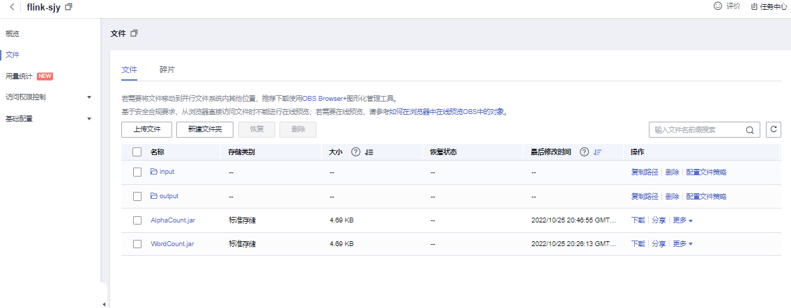

# 华为云MRS Flink实验记录

## 1. 资源创建

### IP


### OBS




创建并行文件系统，创建input、output文件夹，同时上传`wordCount.jar`、`article.txt`、`AlphaCount.jar`。

### MRS资源创建


设置安全组规则，一键放行端口


## 2.WordCount作业


运行结果`output.txt`见附件，这里取前5行

```
(2,1)
(a,37)
(able,7)
(ableto,1)
(again,2)
```

## 3.AlphaCount作业

```java
public class AlphaCount {

    public static void main(String[] args) throws Exception {

        String input = null;
        String output = null;
        ParameterTool params = ParameterTool.fromArgs(args);
        try {
            input = params.getRequired("input");
            output = params.getRequired("output");
        } catch (RuntimeException e) {
            System.out.println("Argument Error");
            e.printStackTrace();
            return;
        }

        ExecutionEnvironment env = ExecutionEnvironment.getExecutionEnvironment();
        env.setParallelism(1);
        DataSet<String> text = env.readTextFile(input);

        DataSet<Tuple2<String, Integer>> counts = text.flatMap(new Tokenizer()).groupBy(0).sum(1);
        counts.writeAsText(output, FileSystem.WriteMode.OVERWRITE);
        env.execute("Flink Alpha Count Java API Skeleton");
    }

    public static class Tokenizer implements FlatMapFunction<String, Tuple2<String, Integer>> {
        @Override
        public void flatMap(String value, Collector<Tuple2<String, Integer>> out) throws Exception {
            String[] tokens = value.toLowerCase().split("[a-z]");
            for (String token : tokens) {
                if (token.length() > 0) {
                    System.out.println(token);
                    out.collect(new Tuple2<String, Integer>(token, 1));
                }
            }
        }
    }
}

```

### 代码分析

Flink 程序的第一步是创建一个 StreamExecutionEnvironment 。这是一个入口类，可以用来设置参数和创建数据源以及提交任务：`ExecutionEnvironment env = ExecutionEnvironment.getExecutionEnvironment();`

为了便于演示，将结果输出于同一个文件中，设置并行度为 1：`env.setParallelism(1)`。

`DataSet text = env.readTextFile(input);`

`DataSet<Tuple2<String, Integer>> counts = text.flatMap(new Tokenizer();`

这里创建了一个字符串类型的`DataSet`。`DataSet`是Flink中做数据处理的API，上面定义了非常多操作，如：过滤、转换、聚合、关联等。这里首先将字符串数据解析成字母和次数，使用`Tuple2<String, Integer>`表示存储。第一个字段是字母，第二个字段是次数，次数初始值设置为1.另外Override了`flatmap`，使用正则表达式分割出所有字母，因为一行可以有许多字母。

总结：切分（flapMap，split），分组（groupBy），统计（累加sum）。

### 执行结果

运行结果可见附件`output2.txt`


```
(a,566)
(b,115)
(c,182)
(d,269)
(e,890)
(f,224)
(g,175)
(h,385)
(i,566)
(j,21)
(k,51)
(l,342)
(m,188)
(n,485)
(o,607)
(p,96)
(q,7)
(r,414)
(s,429)
(t,672)
(u,176)
(v,81)
(w,165)
(x,5)
(y,128)
(z,6)
```

# Flink学习笔记

## 1. Flink 产生背景简介

在当前的互联网用户，设备，服务等激增的时代下，其产生的数据量已不可同日而语了。各种业务场景都会有着大量的数据产生，如何对这些数据进行有效地处理是很多企业需要考虑的问题。以往我们所熟知的Map Reduce，Storm，Spark等框架可能在某些场景下已经没法完全地满足用户的需求，或者是实现需求所付出的代价，无论是代码量或者架构的复杂程度可能都没法满足预期的需求。新场景的出现催产出新的技术，Flink即为实时流的处理提供了新的选择。Apache Flink就是近些年来在社区中比较活跃的分布式处理框架，其相对简单的编程模型加上其高吞吐、低延迟、高性能以及支持exactly-once语义的特性，让它在工业生产中较为出众。

## 2. Flink 架构中的服务类型


在Flink运行时涉及到的进程主要有以下两个： ***JobManager**：主要负责调度task，协调checkpoint已经错误恢复等。当客户端将打包好的任务提交到JobManager之后，JobManager就会根据注册的TaskManager资源信息将任务分配给有资源的TaskManager，然后启动运行任务。TaskManger从JobManager获取task信息，然后使用slot资源运行task；* **TaskManager**：执行数据流的task，一个task通过设置并行度，可能会有多个subtask。 每个TaskManager都是作为一个独立的JVM进程运行的。他主要负责在独立的线程执行的operator。其中能执行多少个operator取决于每个taskManager指定的slots数量。Task slot是Flink中最小的资源单位。假如一个taskManager有3个slot，他就会给每个slot分配1/3的内存资源，目前slot不会对cpu进行隔离。同一个taskManager中的slot会共享网络资源和心跳信息。  
当然在Flink中并不是一个slot只可以执行一个task，在某些情况下，一个slot中也可能执行多个task，如下：  


一般情况下，flink都是默认允许共用slot的，即便不是相同的task，只要都是来同一个job即可。共享slot的好处有以下两点：  

1. 当Job的最高并行度正好和flink集群的slot数量相等时，则不需要计算总的task数量。例如，最高并行度是6时，则只需要6个slot，各个subtask都可以共享这6个slot； 2. 共享slot可以优化资源管理。如下图，非资源密集型subtask `source/map`在不共享slot时会占用6个slot，而在共享的情况下，可以保证其他的资源密集型subtask也能使用这6个slot，保证了资源分配。  


## 3. Flink中的数据

Flink中的数据主要分为两类：**有界数据流(Bounded streams)**和**无界数据流(Unbounded streams)**。

### 3.1 无界数据流

顾名思义，**无界数据流**就是指有始无终的数据，数据一旦开始生成就会持续不断的产生新的数据，即数据没有时间边界。无界数据流需要持续不断地处理。

### 3.2 有界数据流

相对而言，**有界数据流**就是指输入的数据有始有终。例如数据可能是一分钟或者一天的交易数据等等。处理这种有界数据流的方式也被称之为**批处理**：


需要注意的是，我们一般所说的**数据流**是指数据集，而**流数据**则是指数据流中的数据。

## 4. Flink中的编程模型

### 4.1 编程模型

在Flink，编程模型的抽象层级主要分为以下4种，越往下抽象度越低，编程越复杂，灵活度越高。  


这里先不一一介绍，后续会做详细说明。这4层中，一般用于开发的是第三层，即`DataStrem/DataSetAPI`。用户可以使用`DataStream API`处理无界数据流，使用`DataSet API`处理有界数据流。同时这两个API都提供了各种各样的接口来处理数据。例如常见的map、filter、flatMap等等，而且支持python，scala，java等编程语言。


